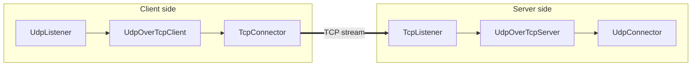

<!--
Documentation version: 107
Sync note: Any change to this file must also be applied to WaterWall/WaterWall-Docs/docs/02-noderefs/UdpOverTcpClient.mdx, and both files must keep the same documentation version.
-->

# UdpOverTcpClient Node

`UdpOverTcpClient` carries discrete UDP-style packets over a TCP-style byte stream. It adds a 2-byte length prefix to each outbound packet and reconstructs packet boundaries again when data comes back from the stream side.

In practice, this node is used together with `UdpOverTcpServer` on the remote side.

## What It Does

- Accepts packet payload from the previous node.
- Prefixes each packet with a 2-byte packet length.
- Sends the framed bytes through the next node.
- Reads bytes coming back from the next node and reconstructs complete packets.
- Forwards reconstructed packets back to the previous node.

This node does not create transport by itself. It relies on the next node to provide a stream-oriented path.

## Typical Placement

A common layout is:

- a UDP-producing node before `UdpOverTcpClient`
- `UdpOverTcpClient`
- a TCP-like transport chain after it
- `UdpOverTcpServer` on the remote side
- UDP-facing nodes after `UdpOverTcpServer`

This pair is useful when you need to tunnel packet-preserving traffic through a stream transport.

## Flow Example



## Configuration Example

```json
{
  "name": "udp-over-tcp-client",
  "type": "UdpOverTcpClient",
  "settings": {},
  "next": "stream-transport"
}
```

## Required JSON Fields

### Top-level fields

- `name` `(string)`
  A user-chosen name for this node.

- `type` `(string)`
  Must be exactly `"UdpOverTcpClient"`.

- `next` `(string)`
  The next node that should carry the framed stream bytes.

### `settings`

There are no required tunnel-specific settings in the current implementation.

## Optional `settings` Fields

There are no tunnel-specific optional settings in the current implementation.

## Detailed Behavior

### Framing model

Each outbound packet is turned into:

- a 2-byte unsigned big-endian length field
- followed by the raw packet payload

When data comes back from the stream side, `UdpOverTcpClient` buffers bytes until it has at least one complete length-prefixed packet, then strips the 2-byte header and forwards the original packet to the previous node.

### Packet size limits

The current maximum accepted packet size is:

- `65535 - 20 - 8 - 2`

That is the maximum packet length defined by this tunnel's implementation.

If an outbound packet is larger than this value, it is dropped.

### Data flow direction

- Packet side to stream side: previous node -> `UdpOverTcpClient` -> next node
- Stream side back to packet side: next node -> `UdpOverTcpClient` -> previous node

This means the previous node should treat this tunnel as packet-preserving, while the next node sees only a byte stream.

### Stream buffering behavior

Incoming bytes from the stream side are stored in a read stream until full packets can be extracted.

Current overflow limit:

- `2 * kMaxAllowedUDPPacketLength`

If the buffered stream grows beyond that limit, the implementation empties the read stream buffer.

It does not currently close the line in that case.

### Lifecycle behavior

When the line is initialized, the tunnel creates the read buffer state and immediately initializes the next node.

When either side finishes, the tunnel destroys its read buffer state and forwards finish to the other side in the normal chain direction.

## Notes And Caveats

- `UdpOverTcpClient` is intended to be paired with `UdpOverTcpServer`.
- There are no tunnel-specific JSON settings today.
- Outbound packets larger than the hard-coded maximum are dropped.
- If the inbound framed byte stream overflows the internal buffer, the buffer is emptied instead of closing the line.
- `UpStreamEst` and `DownStreamInit` are disabled in the current implementation.
