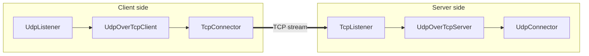

<!--
Documentation version: 152
Sync note: Any change to this file must also be applied to WaterWall/WaterWall-Docs/docs/02-noderefs/UdpOverTcpClient.mdx and WaterWall/WaterWall-Docs/i18n/fa/docusaurus-plugin-content-docs/current/02-noderefs/UdpOverTcpClient.mdx, and all files must keep the same documentation version.
-->

# UdpOverTcpClient Node

`UdpOverTcpClient` carries UDP datagrams over a TCP byte stream. It adds a 2-byte length prefix to each outbound packet and reconstructs packet boundaries again when data comes back from the stream side.

In practice, this node is used together with `UdpOverTcpServer` on the remote side.

## What It Does

- Accepts packet payload from the previous node.
- Prefixes each packet with a 2-byte packet length.
- Sends the framed bytes through the next node.
- Reads bytes coming back from the next node and reconstructs complete packets.
- Forwards reconstructed packets back to the previous node.

This node does not create transport by itself. It relies on the next node to provide a stream-oriented path.

## Typical Placement

A common layout is:

- a UDP-producing node before `UdpOverTcpClient`
- `UdpOverTcpClient`
- a TCP-like transport chain after it
- `UdpOverTcpServer` on the remote side
- UDP-facing nodes after `UdpOverTcpServer`

This pair is useful when you need to tunnel packet-preserving traffic through a stream transport.

## Flow Example


```mermaid
flowchart LR
    subgraph ClientSide["Client side"]
      direction LR
      UL[UdpListener] --> UOTC[UdpOverTcpClient] --> TC[TcpConnector]
    end

    subgraph ServerSide["Server side"]
      direction LR
      TL[TcpListener] --> UOTS[UdpOverTcpServer] --> UC[UdpConnector]
    end

    TC == "TCP stream" ==> TL
```

## Configuration Example

```json
{
  "name": "udp-over-tcp-client",
  "type": "UdpOverTcpClient",
  "settings": {},
  "next": "stream-transport"
}
```

## Required JSON Fields

### Top-level fields

- `name` `(string)`
  A user-chosen name for this node.

- `type` `(string)`
  Must be exactly `"UdpOverTcpClient"`.

- `next` `(string)`
  The next node that should carry the framed stream bytes.

### `settings`

There are no required tunnel-specific settings in the current implementation.

## Optional `settings` Fields

There are no tunnel-specific optional settings in the current implementation.

## Detailed Behavior

### Framing model

Each outbound packet is turned into:

- a 2-byte unsigned big-endian length field
- followed by the raw packet payload

When data comes back from the stream side, `UdpOverTcpClient` buffers bytes until it has at least one complete length-prefixed packet, then strips the 2-byte header and forwards the original packet to the previous node.

Each payload callback on the datagram-facing side represents one UDP datagram. These nodes always carry
UDP payloads; the source protocol metadata does not change their framing. Mixed listeners must route TCP
traffic through a separate path before the client.

### Packet size limits

The maximum outbound UDP datagram size is `65535 - 20 - 8 - 2 = 65505` bytes.
Larger datagrams are dropped intact. Empty outbound payloads violate the existing Debug invariant;
Release drops them. Incoming zero-length frames are invalid and close the carrier.

### Data flow direction

- Packet side to stream side: previous node -> `UdpOverTcpClient` -> next node
- Stream side back to packet side: next node -> `UdpOverTcpClient` -> previous node

This means the previous node should treat this tunnel as packet-preserving, while the next node sees only a byte stream.

### Stream buffering behavior

Incoming stream bytes wait in a read stream until complete datagrams can be extracted.
The incomplete suffix limit is `2 * kMaxAllowedUDPPacketLength = 131010` bytes.

Complete frames drain before the incomplete suffix is checked. Retained buffer charge is capped at 4 MiB,
with beneficial compaction attempted first. Malformed frames, allocation refusal or exhausted storage close
the carrier through its owner. Decoder reentry shares a 2 MiB byte limit and 4 MiB charge limit with its
retained stream. The parser never discards arbitrary stream bytes to continue.

### Lifecycle behavior

When the line is initialized, the client creates its framing state and immediately initializes the next
node. Transport Est, Pause and Resume are forwarded promptly.

When either side sends Finish, the node destroys its own framing state and forwards Finish away from the
sender. It borrows the normal line and does not call `lineDestroy()`.

## Notes And Caveats

- `UdpOverTcpClient` is intended to be paired with `UdpOverTcpServer`.
- There are no tunnel-specific JSON settings today.
- Each datagram-facing payload callback must contain exactly one UDP datagram.
- Invalid zero-length frames and exhausted parser storage close the carrier through its owner.
- `UpStreamEst` and `DownStreamInit` are disabled in the current implementation.

## Splice Support

Both nodes accept ordinary buffers and private-pipe bodies. Each outbound UDP datagram keeps its body,
gains a resident two-byte length prefix, and is forwarded in one callback. Oversized datagrams are dropped
intact. The decoder caches only the two-byte length header and extracts each complete datagram as one owned
buffer, with ordinary fallback when pipe resources are unavailable.

UDP datagram boundaries remain intact, and the TCP carrier remains eligible for splice. Any UDP socket
materialization fallback belongs to the UDP sender. Complete frames in an admitted stream input continue
after Pause; Finish or admission refusal stops processing.

## Node Metadata

Source-backed metadata:

| Property | Value |
| --- | --- |
| node flags | `kNodeFlagSupportsSplice` |
| `can_have_prev` | `true` |
| `can_have_next` | `true` |
| `layer_group` | `kNodeLayer4` |
| `layer_group_prev_node` | `kNodeLayer4` |
| `layer_group_next_node` | `kNodeLayer4` |
| `required_padding_left` | `2` bytes |
