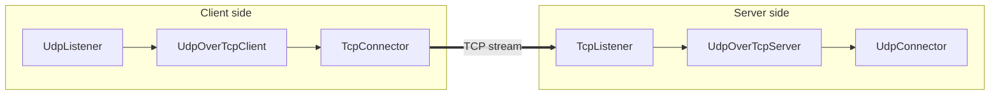

<!--
Documentation version: 107
Sync note: Any change to this file must also be applied to WaterWall/WaterWall-Docs/docs/02-noderefs/UdpOverTcpServer.mdx, and both files must keep the same documentation version.
-->

# UdpOverTcpServer Node

`UdpOverTcpServer` is the server-side peer of `UdpOverTcpClient`. It accepts a framed byte stream from the previous node, reconstructs discrete packets, and forwards those packets to the next node.

In practice, this node is used together with `UdpOverTcpClient` on the other side of the stream transport.

## What It Does

- Accepts framed bytes from the previous node.
- Reconstructs packet boundaries using a 2-byte length prefix.
- Forwards each recovered packet to the next node.
- Accepts packet replies from the next node.
- Prefixes each reply with a 2-byte length field and sends it back through the previous node.

This node expects the previous side of the chain to provide a stream transport.

## Typical Placement

A common layout is:

- a stream-facing transport before `UdpOverTcpServer`
- `UdpOverTcpServer`
- UDP-facing or packet-oriented nodes after it

It should usually sit opposite `UdpOverTcpClient`.

## Flow Example



## Configuration Example

```json
{
  "name": "udp-over-tcp-server",
  "type": "UdpOverTcpServer",
  "settings": {},
  "next": "packet-side-node"
}
```

## Required JSON Fields

### Top-level fields

- `name` `(string)`
  A user-chosen name for this node.

- `type` `(string)`
  Must be exactly `"UdpOverTcpServer"`.

- `next` `(string)`
  The next node that should receive the reconstructed packets.

### `settings`

There are no required tunnel-specific settings in the current implementation.

## Optional `settings` Fields

There are no tunnel-specific optional settings in the current implementation.

## Detailed Behavior

### Framing model

`UdpOverTcpServer` expects each packet on the stream side to be encoded as:

- a 2-byte unsigned big-endian length field
- followed by the raw packet payload

Incoming bytes are buffered until a complete frame is available. Then the 2-byte header is removed and the recovered packet is forwarded to the next node.

Replies from the next node are handled in the opposite direction: each packet gets a 2-byte big-endian length prefix before being written back to the previous side.

### Packet size limits

The current maximum accepted packet size is:

- `65535 - 20 - 8 - 2`

Packets larger than that limit are dropped on the send-back path.

### Data flow direction

- Stream side to packet side: previous node -> `UdpOverTcpServer` -> next node
- Packet replies back to stream side: next node -> `UdpOverTcpServer` -> previous node

### Stream buffering behavior

Incoming stream bytes are stored in a read stream until one or more full packets can be extracted.

Current overflow limit:

- `2 * kMaxAllowedUDPPacketLength`

If the buffered data grows beyond that limit, the implementation empties the read stream buffer.

### Lifecycle behavior

When the line starts, `UdpOverTcpServer` creates the read buffer state and initializes the next node.

When the line finishes from either direction, it destroys the read buffer state and forwards finish to the matching side.

## Notes And Caveats

- `UdpOverTcpServer` is intended to be paired with `UdpOverTcpClient`.
- There are no tunnel-specific JSON settings today.
- Oversized packets are dropped.
- If the inbound framed stream exceeds the internal overflow threshold, the read buffer is emptied instead of closing the line.
- `UpStreamEst` and `DownStreamInit` are disabled in the current implementation.
