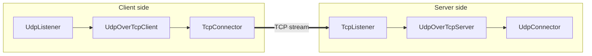

<!--
Documentation version: 152
Sync note: Any change to this file must also be applied to WaterWall/WaterWall-Docs/docs/02-noderefs/UdpOverTcpServer.mdx and WaterWall/WaterWall-Docs/i18n/fa/docusaurus-plugin-content-docs/current/02-noderefs/UdpOverTcpServer.mdx, and all files must keep the same documentation version.
-->

# UdpOverTcpServer Node

`UdpOverTcpServer` is the server-side peer of `UdpOverTcpClient`. It accepts a framed byte stream from the previous node, reconstructs UDP datagrams, and forwards those packets to the next node.

In practice, this node is used together with `UdpOverTcpClient` on the other side of the stream transport.

## What It Does

- Accepts framed bytes from the previous node.
- Reconstructs packet boundaries using a 2-byte length prefix.
- Forwards each recovered packet to the next node.
- Accepts packet replies from the next node.
- Prefixes each reply with a 2-byte length field and sends it back through the previous node.

This node expects the previous side of the chain to provide a stream transport.

## Typical Placement

A common layout is:

- a stream-facing transport before `UdpOverTcpServer`
- `UdpOverTcpServer`
- UDP-facing nodes after it

It should usually sit opposite `UdpOverTcpClient`.

## Flow Example


```mermaid
flowchart LR
    subgraph ClientSide["Client side"]
      direction LR
      UL[UdpListener] --> UOTC[UdpOverTcpClient] --> TC[TcpConnector]
    end

    subgraph ServerSide["Server side"]
      direction LR
      TL[TcpListener] --> UOTS[UdpOverTcpServer] --> UC[UdpConnector]
    end

    TC == "TCP stream" ==> TL
```

## Configuration Example

```json
{
  "name": "udp-over-tcp-server",
  "type": "UdpOverTcpServer",
  "settings": {},
  "next": "packet-side-node"
}
```

## Required JSON Fields

### Top-level fields

- `name` `(string)`
  A user-chosen name for this node.

- `type` `(string)`
  Must be exactly `"UdpOverTcpServer"`.

- `next` `(string)`
  The next node that should receive the reconstructed packets.

### `settings`

There are no required tunnel-specific settings in the current implementation.

## Optional `settings` Fields

There are no tunnel-specific optional settings in the current implementation.

## Detailed Behavior

### Framing model

`UdpOverTcpServer` expects each packet on the stream side to be encoded as:

- a 2-byte unsigned big-endian length field
- followed by the raw packet payload

Incoming bytes are buffered until a complete frame is available. Then the 2-byte header is removed and the recovered packet is forwarded to the next node.

Replies from the next node are handled in the opposite direction: each packet gets a 2-byte big-endian length prefix before being written back to the previous side.

Each payload callback on the datagram-facing side represents one UDP datagram. These nodes always carry
UDP payloads; the source protocol metadata does not change their framing. Mixed listeners must route TCP
traffic through a separate path before the client.

### Packet size limits

The maximum outbound UDP datagram size is `65535 - 20 - 8 - 2 = 65505` bytes.
Larger datagrams are dropped intact. Empty outbound payloads violate the existing Debug invariant;
Release drops them. Incoming zero-length frames are invalid and close the carrier.

### Data flow direction

- Stream side to packet side: previous node -> `UdpOverTcpServer` -> next node
- Packet replies back to stream side: next node -> `UdpOverTcpServer` -> previous node

### Stream buffering behavior

Incoming stream bytes wait in a read stream until complete datagrams can be extracted.
The incomplete suffix limit is `2 * kMaxAllowedUDPPacketLength = 131010` bytes.

Complete frames drain before the incomplete suffix is checked. Retained buffer charge is capped at 4 MiB,
with beneficial compaction attempted first. Malformed frames, allocation refusal or exhausted storage close
the carrier through its owner. Decoder reentry shares a 2 MiB byte limit and 4 MiB charge limit with its
retained stream. The parser never discards arbitrary stream bytes to continue.

### Lifecycle behavior

When the line is initialized, the server creates its framing state, sets the destination protocol to UDP,
and immediately initializes the next node. Transport Est, Pause and Resume are forwarded promptly.

When either side sends Finish, the node destroys its own framing state and forwards Finish away from the
sender. It borrows the normal line and does not call `lineDestroy()`.

## Notes And Caveats

- `UdpOverTcpServer` is intended to be paired with `UdpOverTcpClient`.
- There are no tunnel-specific JSON settings today.
- Each datagram-facing payload callback must contain exactly one UDP datagram.
- Invalid zero-length frames and exhausted parser storage close the carrier through its owner.
- `UpStreamEst` and `DownStreamInit` are disabled in the current implementation.

## Splice Support

Both nodes accept ordinary buffers and private-pipe bodies. Each outbound UDP datagram keeps its body,
gains a resident two-byte length prefix, and is forwarded in one callback. Oversized datagrams are dropped
intact. The decoder caches only the two-byte length header and extracts each complete datagram as one owned
buffer, with ordinary fallback when pipe resources are unavailable.

UDP datagram boundaries remain intact, and the TCP carrier remains eligible for splice. Any UDP socket
materialization fallback belongs to the UDP sender. Complete frames in an admitted stream input continue
after Pause; Finish or admission refusal stops processing.

## Node Metadata

Source-backed metadata:

| Property | Value |
| --- | --- |
| node flags | `kNodeFlagSupportsSplice` |
| `can_have_prev` | `true` |
| `can_have_next` | `true` |
| `layer_group` | `kNodeLayer4` |
| `layer_group_prev_node` | `kNodeLayer4` |
| `layer_group_next_node` | `kNodeLayer4` |
| `required_padding_left` | `2` bytes |
